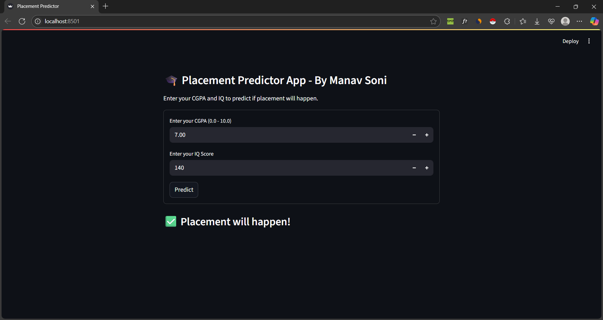

  

# 🎓 Placement Predictor (ML + Streamlit)

This project predicts whether a student will be placed or not based on their CGPA and IQ.

## 🔍 Features
- Simple 2-input prediction (CGPA, IQ)
- Streamlit-based UI with real-time result
- Trained with Logistic Regression 
- Scaler applied to inputs for accuracy

## 🧪 Test Cases
| CGPA | IQ  | Prediction       |
|------|-----|------------------|
| 9.0  | 130 | ✅ Placement      |
| 6.1  | 156 | ❌ Not Placed     |
| 7.0  | 110 | ✅ Likely Placed  |

## 🛠️ Tech Stack
- Streamlit
- Scikit-learn
- NumPy

## 📁 Files
- `app.py`: Streamlit frontend
- `placement_model.pkl`: Trained ML model
- `scaler.pkl`: StandardScaler used in training
- `requirements.txt`: Dependencies
